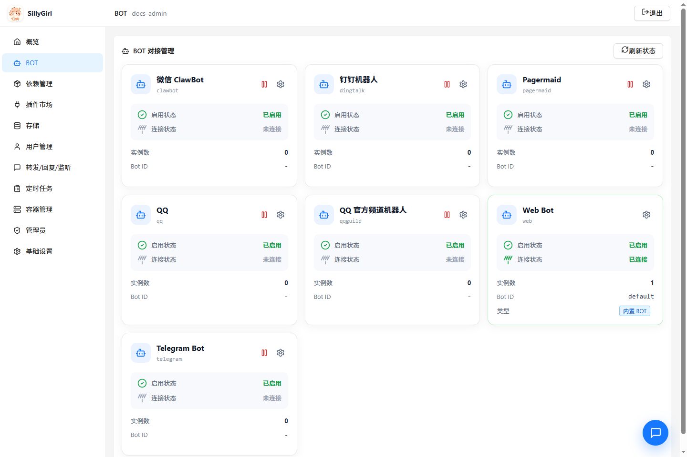

# 适配器指南

[返回项目导航](../README.md) · [界面截图](screenshots.md) · [API 与存储](api-storage.md) · [插件编写](plugin-development.md)

适配器把平台事件转换为 SillyGirl 的统一消息模型，再把插件回复发送回原平台。当前内置 7 个适配器。



## 支持矩阵

| 平台标识 | 接入方式 | 收消息 | 发消息 | 主要配置 |
|---|---|---|---|---|
| `clawbot` | 微信 iLink HTTP 长轮询 | `getupdates` | `sendmessage` | `token`、`api_base` |
| `qq` | OneBot 反向 WebSocket | `/qq/receive` | WebSocket action | `token` |
| `telegram` | Telegram Bot API 长轮询 | `getUpdates` | `sendMessage` | `token`、`api_base` |
| `dingtalk` | 钉钉 Stream | Stream callback | `sessionWebhook` | `client_id`、`client_secret` |
| `qqguild` | BotGo Webhook/WebSocket | `/qqguild/webhook` 或 Gateway | OpenAPI | `app_id`、`app_secret`、`mode` |
| `web` | 浏览器长轮询 | `/api/web-chat/messages` | 内置消息队列 | `web_chat_public` |
| `pagermaid` | WebSocket 桥接 | `/pagermaid/receive` | WebSocket action | `token` |

## 通用配置

推荐在管理后台 `/admin/bots` 完成配置。底层配置分别保存在同名 Bucket 中，常用键如下：

| 键 | 含义 |
|---|---|
| `enable` | 设为 `false` 时停用适配器；未配置时按各适配器默认值处理 |
| `debug` | 输出该适配器的收发调试日志 |
| `token` / `client_secret` / `app_secret` | 平台认证凭据，后台以密码输入框维护 |
| `api_base` | 可选兼容 API 或反向代理基址 |

配置变化会触发适配器刷新或重启。状态页出现稳定的 Bot ID，表示 `core.Factory` 已注册成功。

## 微信 ClawBot

ClawBot 使用腾讯 OpenClaw 微信通道同款 iLink API。后台点击“扫码获取”后生成二维码；确认成功会保存 `clawbot.token` 并启动长轮询。

| Bucket | Key | 说明 |
|---|---|---|
| `clawbot` | `token` | iLink bot token |
| `clawbot` | `enable` | 可选开关 |
| `clawbot` | `api_base` | 默认 `https://ilinkai.weixin.qq.com` |
| `clawbot` | `cdn_base_url` | 可选媒体 CDN 基址 |
| `clawbot` | `debug` | 调试日志 |

回复依赖上游消息的 `context_token`。图片消息会在有效期内下载并转存为本地临时资源，插件应及时处理收到的媒体地址。

## QQ / OneBot

在 NapCat、Lagrange.OneBot 等兼容端配置反向 WebSocket：

```text
ws://HOST:8080/qq/receive
wss://HOST/qq/receive
```

```json
{
  "enable": true,
  "url": "ws://HOST:8080/qq/receive",
  "accessToken": "TOKEN"
}
```

SillyGirl 的 `qq.token` 必须与 OneBot 客户端的 `accessToken` 一致。连接建立后，Bot ID 从 `X-Self-ID` 或 OneBot 事件中确定。

## Telegram Bot

1. 从 BotFather 获取 Bot Token。
2. 在 `/admin/bots` 填写 Token。
3. 需要代理时填写兼容 `api_base`。
4. 保存后检查日志与 BOT 状态。

| Bucket | Key | 说明 |
|---|---|---|
| `telegram` | `token` | Bot Token |
| `telegram` | `enable` | 可选开关 |
| `telegram` | `api_base` | 默认 `https://api.telegram.org` |
| `telegram` | `debug` | 调试日志 |

适配器启动时清理旧 webhook，然后使用长轮询接收更新。

## 钉钉机器人

钉钉适配器使用 Stream 模式，不需要公网回调地址。文本回复复用事件中的 `sessionWebhook`。

| Bucket | Key | 说明 |
|---|---|---|
| `dingtalk` | `client_id` | Client ID / AppKey |
| `dingtalk` | `client_secret` | Client Secret / AppSecret |
| `dingtalk` | `enable` | 可选开关 |
| `dingtalk` | `debug` | 调试日志 |

在钉钉开放平台创建机器人并启用 Stream 模式，保存配置后检查 `Stream 已连接` 日志。

## QQ 官方频道机器人

平台标识为 `qqguild`，与 `qq` OneBot 独立。支持 Webhook 和 WebSocket 两种模式。

```text
https://HOST/qqguild/webhook
```

| Bucket | Key | 说明 |
|---|---|---|
| `qqguild` | `app_id` | 机器人 AppID |
| `qqguild` | `app_secret` | 机器人 AppSecret |
| `qqguild` | `mode` | `webhook` 或 `websocket` |
| `qqguild` | `sandbox` | 是否使用沙箱 OpenAPI |
| `qqguild` | `enable` | 可选开关 |
| `qqguild` | `debug` | 调试日志 |

Webhook 模式要求可访问的 HTTPS 地址；WebSocket 模式由 SillyGirl 主动连接 Gateway。

## Web Bot

Web Bot 随主程序注册为 `web/default`，后台右下角可直接打开聊天窗口。

| 配置 | 说明 |
|---|---|
| `sillyGirl.web_chat_public=false` | 仅已登录管理员可发送消息，推荐默认值 |
| `sillyGirl.web_chat_public=true` | 允许匿名调用聊天接口 |

```bash
curl 'http://HOST:8080/api/web-chat/messages?rid=SESSION'
curl -X POST 'http://HOST:8080/api/web-chat/messages' \
  -H 'Content-Type: application/json' \
  -d '{"rid":"SESSION","ctt":"你好"}'
```

每个 `rid` 对应独立的有界消息队列，长时间不活跃会自动过期。

## Pagermaid

仓库中的桥接插件位于 [`adapters/pagermaid/sillyplus.py`](../adapters/pagermaid/sillyplus.py)。

```text
ws://HOST:8080/pagermaid/receive?token=TOKEN
wss://HOST/pagermaid/receive?token=TOKEN
```

| Bucket | Key | 说明 |
|---|---|---|
| `pagermaid` | `token` | WebSocket 连接密钥 |
| `pagermaid` | `enable` | 可选开关 |
| `pagermaid` | `debug` | 调试日志 |

桥接脚本只负责转发消息和执行发消息动作；群监听、屏蔽用户、管理员判断和插件规则均由核心处理。

## 统一消息模型

适配器调用 `Factory.Receive` 时至少应提供：

```go
params := map[string]interface{}{
    core.USER_ID:    "ACCOUNT",
    core.CHAT_ID:    "GROUP_OR_CHANNEL",
    core.CONETNT:    "消息正文",
    core.MESSAGE_ID: "MESSAGE_ID",
    "user_name":    "昵称",
    "chat_name":    "会话名称",
}
adapter.Receive(params)
```

平台 ID 统一转成字符串；私聊的 `chat_id` 可为空。发送端通过 `SetReplyHandler` 读取同一组标准字段并返回平台消息 ID。

## 排查顺序

1. 在 BOT 页面确认适配器已启用。
2. 检查必需凭据和接入 URL。
3. 确认日志中不存在认证、超时或重复连接错误。
4. 检查 BOT 页面是否出现稳定 Bot ID。
5. 用私聊和群聊各触发一次最小插件规则。
6. 确认 `user_id`、`chat_id`、`message_id` 和回复目标正确。
7. 临时打开 `debug` 定位问题，完成后关闭，避免日志包含过量上下文。
